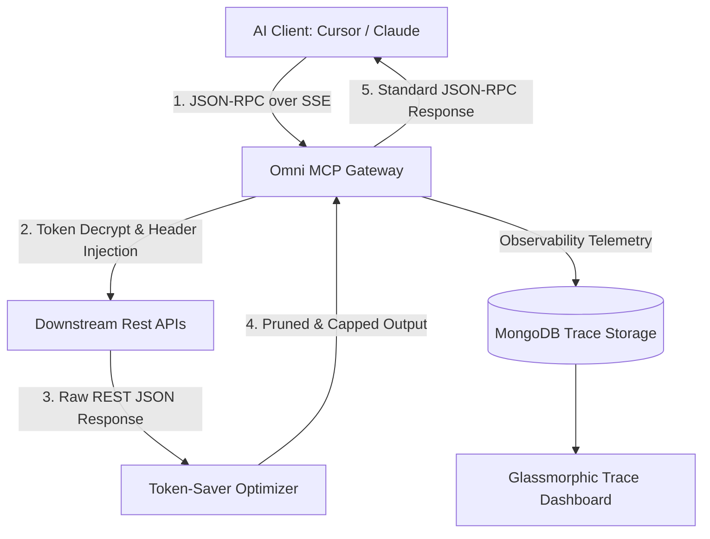

# 🌐 Omni Rest-to-MCP: The Premium OpenAPI to Model Context Protocol Gateway

[](LICENSE)
[](https://www.typescriptlang.org/)
[](https://modelcontextprotocol.io/)

Omni Rest-to-MCP is an enterprise-grade developer gateway proxy and real-time observability console. It bridges arbitrary JSON/YAML OpenAPI microservices dynamically into standardized **Model Context Protocol (MCP)** tools for AI orchestrators (e.g., Cursor, Claude Desktop, Langchain) while optimizing LLM token consumption, safeguarding API secrets, and providing deep OpenTelemetry tracking.



---

## 🚀 Key Features

*   **⚡ Dynamic OpenAPI Translation**: Connect any OpenAPI-compliant JSON/YAML URL or specification. The gateway compiles paths, schemas, and descriptors on-the-fly into standardized MCP tool definitions (`tools/list`).
*   **📉 Token-Saver Compression Engine**: Automatically slices massive REST arrays, prunes nested elements beyond maximum depth thresholds, and strips metadata (such as `_links` or `href`), reducing prompt sizes by **70% to 90%** for massive cost savings.
*   **🔭 Traceparent Context Propagation**: Fully implements W3C Trace Context propagation. Every proxied execution carries standard `traceparent` headers downstream, enabling complete distributed OpenTelemetry tracking.
*   **🧠 Advanced AI Telemetry Extraction**: Captures the orchestrating client program identifier (Cursor/Claude Desktop), active AI model (e.g., `claude-3-5-sonnet`), and the exact prompt intent, logging them in database execution traces.
*   **🛡️ Secure Symmetric Secrets Vault**: Employs AES-256-GCM symmetric encryption for custom headers and authorization keys. Secrets are decrypted solely in-memory at execution, and database trace logs redact sensitive credentials as `[REDACTED]`.
*   **🔒 Multi-Tenant Auth Architecture**: Built with secure, cryptographically signed HTTP-Only Cookie-based sessions, timing-safe password validations, and numeric 6-digit OTP verification flows.
*   **📊 Premium Glassmorphic Dashboard**: A stunning real-time console with interactive timeline explorer widgets mapping handshake splits, remote API latencies, and payload size reductions.

---

## 🛠️ Quick Start

### 1. Prerequisites
*   Node.js (v20+ recommended)
*   MongoDB (local instance or Atlas connection)

### 2. Environment Configuration
Create a `.env` file inside `/backend` folder:
```env
PORT=3001
MONGODB_URI=mongodb://localhost:27017/rest-to-mcp
SESSION_SECRET=your_cookie_signed_secret_32_chars_min
VAULT_KEY=your_aes_256_symmetric_key_64_hex_chars
```

### 3. Install Dependencies
```bash
# Install and run backend
cd backend
npm install
npm run dev

# Install and run frontend
cd ../frontend
npm install
npm run dev
```

### 4. Access the Dashboard
Open [http://localhost:3000](http://localhost:3000) in your browser.
1. Sign up/Log in using the secure OTP flow.
2. Under **Connect New API**, drop an OpenAPI Spec JSON/YAML URL or raw specification.
3. Your gateway SSE endpoint will live at:
   `http://localhost:3001/api/mcp/sse?apiKey=YOUR_SECURE_VAULT_KEY`
4. Connect this SSE link directly into Cursor or Claude Desktop to start using your custom APIs!

---

## 📋 Comprehensive Feature Document

For a thorough deep-dive into our backend architectures, security vault encryptions, Token-Saver parameters, and OpenTelemetry heuristics, review our [Features Guide](docs/features.md).

---

## 🧪 Testing Suite
Execute the full mock-based integration and regression suite in `/backend`:
```bash
cd backend
npm test
```
All route checks, adversarial payload sanitizers, and token cryptographies compile under strict TypeScript type checks.

---

## 📄 License
This project is licensed under the MIT License - see the [LICENSE](LICENSE) file for details.
